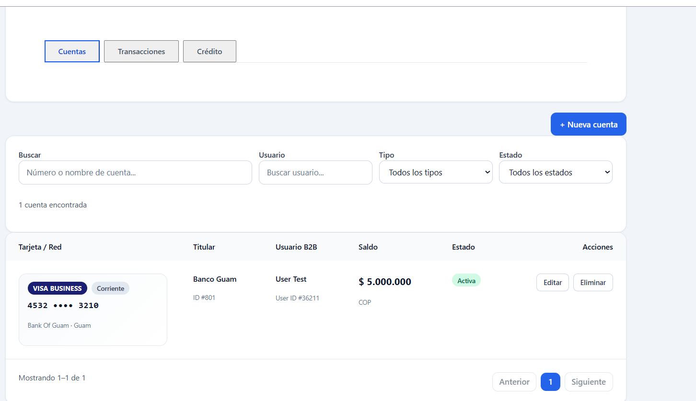
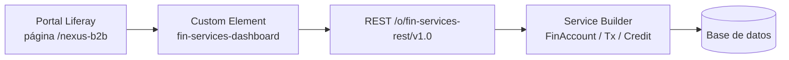
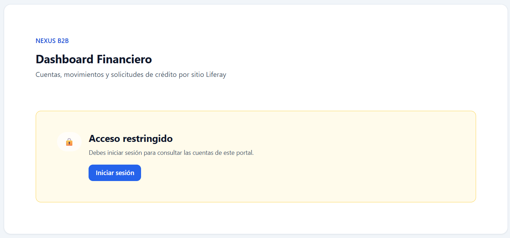
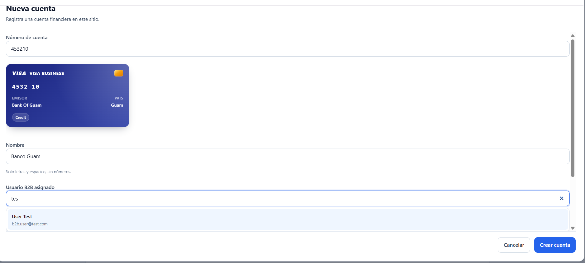
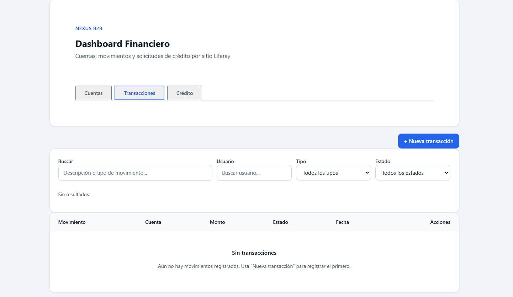
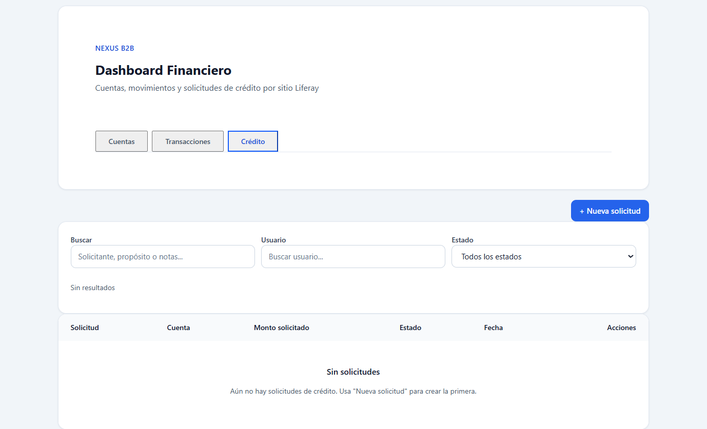

# Nexus B2B Dashboard — Liferay Client Extension

Portal B2B sobre **Liferay DXP 2026.Q2.6**: dominio con **Service Builder**, API con **REST Builder** y UI React como **Client Extension** (Custom Element).

[](https://openjdk.org/)
[](https://react.dev/)
[](https://www.liferay.com/)
[](LICENSE)
[](https://github.com/cristianjoya/nexus-b2b-dashboard-liferay)



---

## Highlights

- Arquitectura **headless** en Liferay: Service Builder → REST Builder → Client Extension React (sin MVC Portlets ni JSP).
- Dominio B2B completo: **cuentas** (BIN / red), **transacciones** con impacto en saldo y **crédito** con aprobación.
- Seguridad por roles de sitio: **B2B Manager** vs **B2B User** (solo cuentas asignadas); guest bloqueado.
- Scope por sitio Liferay (`groupId`), scripts Groovy de demo y checklist en [docs/DEMO.md](docs/DEMO.md).

---

## ¿Qué es esto?

Aplicación B2B financiera embebida en Liferay: dominio con Service Builder, API REST y UI React como Custom Element.

| Capacidad | Detalle |
|-----------|---------|
| Cuentas | CRUD, detección de red (BIN), owner B2B, filtros |
| Transacciones | Movimientos con impacto en saldo |
| Crédito | Solicitudes + aprobación/rechazo |
| Seguridad | Guest bloqueado; Manager vs B2B User (solo cuentas asignadas) |
| Scope | Datos por sitio Liferay (`groupId`) |



---

## Capturas

**Sin sesión** — el CE exige autenticación:



**Alta de cuenta** — preview BIN (Visa) + typeahead de usuario B2B:



**Transacciones** y **Crédito** (mismas pestañas / filtros):





Galería completa y checklist: [docs/DEMO.md](docs/DEMO.md).

---

## Uso de la aplicación

### Roles de sitio

En el **sitio** donde está la página del dashboard, crea roles de sitio:

| Rol | Permisos en la aplicación |
|-----|---------------------------|
| **B2B Manager** | Ve todas las cuentas del sitio, asigna owners, aprueba crédito |
| **B2B User** | Solo ve/opera las cuentas donde es `owner` |

Asigna cada rol a un usuario de prueba distinto. Luego:

1. Script `scripts/assign-b2b-user-role.groovy` → mete al B2B User en el sitio.
2. Script `scripts/seed-demo-data.groovy` → crea cuentas/movimientos de ejemplo (opcional).
3. Script `scripts/assign-b2b-account-owners.groovy` → asigna owners a cuentas existentes.

### Dónde entrar

1. Arranca Liferay → `http://localhost:8080`
2. Abre la página con el widget (p. ej. `http://localhost:8080/nexus-b2b`)
3. Inicia sesión (sin sesión el dashboard pide login)

### Pestañas del dashboard

| Pestaña | Quién la usa | Operaciones típicas |
|---------|--------------|---------------------|
| **Cuentas** | Manager crea/asigna; User solo consulta las suyas | Crear cuenta con número tipo tarjeta (Luhn), asignar B2B User, filtrar por usuario |
| **Transacciones** | Ambos (User solo en sus cuentas) | Alta de depósito/retiro/pago y ver cambio de saldo |
| **Crédito** | User solicita; Manager revisa | Crear solicitud → Manager aprueba/rechaza (el saldo se ajusta al aprobar) |

### Flujo de prueba recomendado

1. **Manager:** crear 2 cuentas → asignar una al B2B User.
2. **B2B User (otra sesión/navegador):** verificar que solo ve su cuenta → crear una transacción y una solicitud de crédito.
3. **Manager:** filtrar por usuario → revisar/aprobar crédito → comprobar saldo.
4. **Guest / sin login:** recargar sin sesión → mensaje de acceso restringido.

Checklist completo: [docs/DEMO.md](docs/DEMO.md).

---

## Inicio rápido (desarrollo)

### Requisitos

- JDK **17**
- Liferay DXP **2026.Q2.6** + licencia de desarrollo
- Git (Service Builder lo requiere)

### 1. Workspace

```powershell
git clone https://github.com/cristianjoya/nexus-b2b-dashboard-liferay.git
cd nexus-b2b-dashboard-liferay
```

Crea `gradle-local.properties` en la raíz (**no se versiona**):

```properties
liferay.workspace.home.dir=C:/ruta/a/tu/liferay-bundle
```

```powershell
.\gradlew.bat initBundle
```

Coloca la licencia en `<LIFERAY_HOME>/deploy/`.

### 2. Desplegar

```powershell
.\gradlew.bat :modules:fin-services:fin-services-service:buildService
.\gradlew.bat :modules:fin-services-rest:fin-services-rest-impl:buildREST
.\gradlew.bat deploy
```

### 3. Arrancar y colocar el widget

```powershell
cd <LIFERAY_HOME>/tomcat/bin
.\catalina.bat run
```

1. Inicia sesión en el portal.
2. Edita una página del sitio (friendly URL de página sugerida: `/nexus-b2b`).
3. **Widgets → Client Extensions → Nexus Fin Services Dashboard**.
4. Publica.

### 4. Datos de ejemplo

Control Panel → Configuration → **Server Administration → Script** (Groovy):

| Script | Uso |
|--------|-----|
| `scripts/assign-b2b-user-role.groovy` | Asigna rol B2B User + membresía de sitio |
| `scripts/seed-demo-data.groovy` | Cuentas, transacciones y crédito de ejemplo |
| `scripts/assign-b2b-account-owners.groovy` | Asigna `ownerUserId` masivo |

Edita los emails `@example.com` en cada script antes de ejecutar.

---

## Estructura del repo

```text
client-extensions/fin-services-dashboard/   # React Custom Element
modules/fin-services/                       # Service Builder
modules/fin-services-rest/                  # REST Builder
configs/                                    # portal-ext de ejemplo por entorno
scripts/                                    # Groovy de setup / demo
docs/                                       # Guía de demo + capturas
```

---

## API (referencia)

Base: `/o/fin-services-rest/v1.0` · OpenAPI: `/o/fin-services-rest/v1.0/openapi.json`

| Recurso | Endpoints |
|---------|-----------|
| Cuentas | `GET/POST /accounts`, `GET/PUT/DELETE /accounts/{id}`, `GET /assignable-b2b-users` |
| Transacciones | `GET/POST /transactions`, `GET/PUT/DELETE /transactions/{id}` |
| Crédito | `GET/POST /credit-applications`, `GET/PUT/DELETE /credit-applications/{id}` |
| Permisos UI | `GET /permissions` |
| BIN | `GET /card-bin/{bin}` (autenticado; solo BIN, sin PAN en query) |

---

## Decisiones de diseño

**Usa:** Service Builder, REST Builder, Client Extensions, CSRF de Liferay, alcance por sitio, ownership B2B.

**No usa:** MVC Portlets, JSP/FTL, Liferay Objects, ni acceso directo del frontend al LocalService.

---

## Limitaciones conocidas

- Entorno de referencia técnica, no un core bancario productivo.
- Validación Luhn + lookup BIN sobre números de ejemplo; sin vault PCI.
- Permisos B2B por matriz de roles de sitio (no `ModelResourcePermission` completo de Liferay).
- Montos como `double` (en producción suele preferirse centavos / `BigDecimal`).
- Hypersonic por defecto; otras BD se configuran con las plantillas de `configs/`.

---

## Comandos frecuentes

```powershell
.\gradlew.bat deploy
.\gradlew.bat :client-extensions:fin-services-dashboard:deploy
.\gradlew.bat :modules:fin-services:fin-services-service:buildService
.\gradlew.bat :modules:fin-services-rest:fin-services-rest-impl:buildREST
```

---

## Documentación adicional

| Doc | Contenido |
|-----|-----------|
| [docs/DEMO.md](docs/DEMO.md) | Capturas, checklist de prueba y flujo de verificación |

---

## Licencia

Este repositorio se publica bajo [MIT](LICENSE) como código de referencia técnica. **Liferay DXP** requiere su propia licencia comercial; no está incluida aquí.

## Autor

[Cristian Joya](https://github.com/cristianjoya) · [LinkedIn](https://www.linkedin.com/in/cristian-esteban-joya-martinez/)
