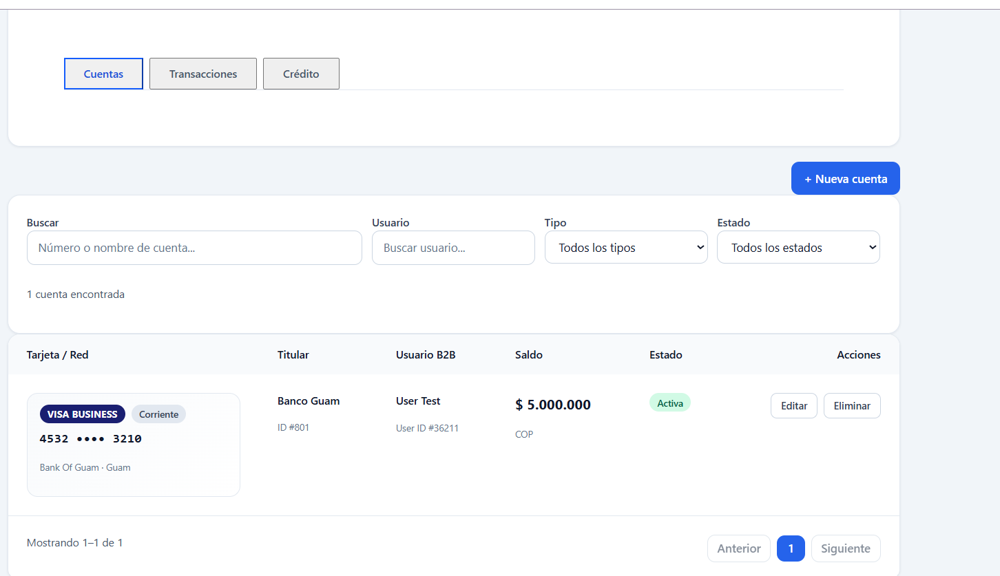
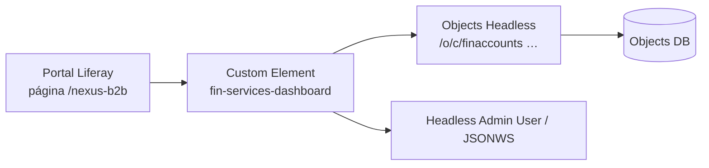
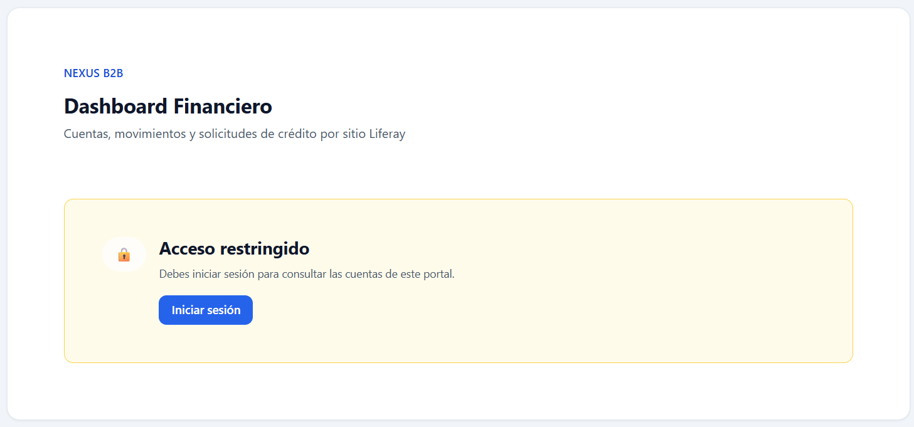
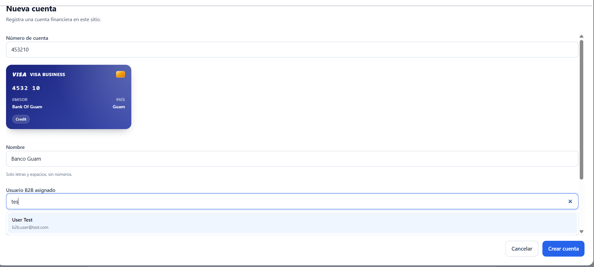
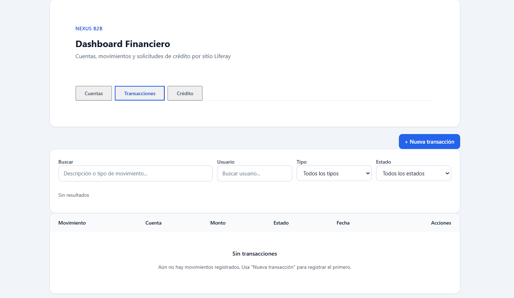
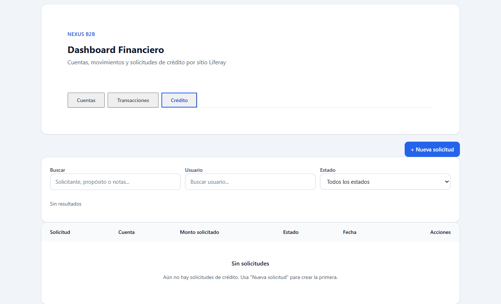

# Nexus B2B Dashboard — Liferay Client Extension

Portal B2B sobre **Liferay DXP 2026.Q2.6**: dominio con **Liferay Objects**, UI React como **Client Extension** (Custom Element) y Object Actions Groovy para el ledger.

[](https://openjdk.org/)
[](https://react.dev/)
[](https://www.liferay.com/)
[](LICENSE)
[](https://github.com/cristianjoya/nexus-b2b-dashboard-liferay)



---

## Highlights

- Arquitectura **moderna** en Liferay: Objects (site-scoped) → Headless `/o/c/...` → Client Extension React.
- Dominio B2B: **cuentas** (BIN / red), **transacciones** y **crédito** con saldo recalculado por Object Action.
- Seguridad por roles de sitio: **B2B Manager** vs **B2B User** (solo cuentas asignadas); guest bloqueado.
- Scope por sitio Liferay; guías en [docs/objects/](docs/objects/).

---

## ¿Qué es esto?

Aplicación B2B financiera embebida en Liferay con Objects + React Custom Element.

| Capacidad | Detalle |
|-----------|---------|
| Cuentas | CRUD Objects, detección de red (BIN), owner B2B, filtros |
| Transacciones | Movimientos; el Action recalcula saldo |
| Crédito | Solicitudes + aprobación/rechazo (impacta saldo) |
| Seguridad | Guest bloqueado; Manager vs B2B User (solo cuentas asignadas) |
| Scope | Datos por sitio (`scopes/{siteGroupId}`) |


```mermaid
flowchart LR
  A[Portal Liferay<br/>página /nexus-b2b] --> B["Custom Element<br/>fin-services-dashboard"]
  B --> C["Objects Headless<br/>/o/c/finaccounts …"]
  B --> D["Headless Admin User / JSONWS"]
  C --> E[(Objects DB)]
```

---

## Capturas

**Sin sesión** — el CE exige autenticación:



**Alta de cuenta** — preview BIN (Visa) + typeahead de usuario B2B:



**Transacciones** y **Crédito**:





Galería completa y checklist: [docs/DEMO.md](docs/DEMO.md).

---

## Uso de la aplicación

### Roles de sitio

En el **sitio** donde está la página del dashboard, crea roles de sitio:

| Rol | Permisos en la aplicación |
|-----|---------------------------|
| **B2B Manager** | Ve todas las cuentas del sitio, asigna owners, aprueba crédito |
| **B2B User** | Solo ve/opera las cuentas donde es `owner` |

Asigna cada rol a un usuario de prueba distinto. Luego:

1. `scripts/grant-b2b-object-permissions.groovy` → permisos Objects a los roles (una vez).
2. `scripts/assign-b2b-user-role.groovy` → membresía de sitio + rol B2B (por usuario).
3. (Opcional) `scripts/seed-demo-data.groovy` → datos de ejemplo.

Detalle: [docs/objects/ROLES-PERMISSIONS.md](docs/objects/ROLES-PERMISSIONS.md).

### Dónde entrar

1. Arranca Liferay → `http://localhost:8080`
2. Abre la página con el widget (p. ej. `http://localhost:8080/nexus-b2b`)
3. Inicia sesión (sin sesión el dashboard pide login)

### Pestañas del dashboard

| Pestaña | Quién la usa | Operaciones típicas |
|---------|--------------|---------------------|
| **Cuentas** | Manager crea/asigna; User solo consulta las suyas | Crear cuenta con número tipo tarjeta (Luhn), asignar B2B User |
| **Transacciones** | Ambos (User solo en sus cuentas) | Alta de depósito/retiro/pago; el Action actualiza saldo |
| **Crédito** | User solicita; Manager revisa | Crear solicitud → Manager aprueba/rechaza |

### Flujo de prueba recomendado

1. **Manager:** crear 2 cuentas → asignar una al B2B User.
2. **B2B User (otra sesión/navegador):** verificar que solo ve su cuenta → crear una transacción y una solicitud de crédito.
3. **Manager:** filtrar por usuario → revisar/aprobar crédito → comprobar saldo.
4. **Guest / sin login:** recargar sin sesión → mensaje de acceso restringido.

Checklist completo: [docs/DEMO.md](docs/DEMO.md).

---

## Inicio rápido (desarrollo)

### Requisitos

- JDK **17**
- Liferay DXP **2026.Q2.6** + licencia de desarrollo
- Node.js (build del CE vía Gradle/Vite)

### 1. Workspace

```powershell
git clone https://github.com/cristianjoya/nexus-b2b-dashboard-liferay.git
cd nexus-b2b-dashboard-liferay
```

Crea `gradle-local.properties` en la raíz (**no se versiona**):

```properties
liferay.workspace.home.dir=C:/ruta/a/tu/liferay-bundle
```

```powershell
.\gradlew.bat initBundle
```

Coloca la licencia en `<LIFERAY_HOME>/deploy/`.

### 2. Objects (una vez)

Importa picklists + Objects desde [`docs/objects/exports/`](docs/objects/exports/) (orden en el README de esa carpeta). Configura las 6 Object Actions Groovy ([Fase 2](docs/objects/PHASE2-GUIDE.md)). Activa Script Management si hace falta.

### 3. Desplegar el Client Extension

```powershell
.\gradlew.bat :client-extensions:fin-services-dashboard:deploy
```

### 4. Arrancar y colocar el widget

```powershell
cd <LIFERAY_HOME>/tomcat/bin
.\catalina.bat run
```

1. Inicia sesión en el portal.
2. Edita una página del sitio (friendly URL sugerida: `/nexus-b2b`).
3. **Widgets → Client Extensions → Nexus Fin Services Dashboard**.
4. Publica.

### 5. Datos de ejemplo (opcional)

Control Panel → Configuration → **Server Administration → Script** (Groovy):

| Script | Uso |
|--------|-----|
| `scripts/grant-b2b-object-permissions.groovy` | Permisos Objects → roles B2B (una vez por entorno) |
| `scripts/assign-b2b-user-role.groovy` | Membresía de sitio + rol B2B (por usuario) |
| `scripts/diagnose-b2b-user-roles.groovy` | Ver roles/membresía de un usuario |
| `scripts/seed-demo-data.groovy` | Cuentas / txs / crédito de ejemplo |

Edita los emails `@example.com` (y la friendly URL si aplica) antes de ejecutar.

---

## Estructura del repo

```text
client-extensions/fin-services-dashboard/   # React Custom Element → Objects
docs/objects/                               # Exports picklists/Objects, Actions, guías
configs/                                    # portal-ext de ejemplo por entorno
scripts/                                    # Groovy de setup / demo (Objects)
```

---

## API (referencia)

Dominio (site-scoped):

| Recurso | Base |
|---------|------|
| Cuentas | `/o/c/finaccounts/scopes/{siteGroupId}` |
| Transacciones | `/o/c/fintransactions/scopes/{siteGroupId}` |
| Crédito | `/o/c/fincreditapplications/scopes/{siteGroupId}` |

Auxiliares en el CE (sin módulo custom): roles vía **JSONWS**, BIN vía heurística local (+ binlist si CORS lo permite).

Guías: [PHASE1](docs/objects/PHASE1-GUIDE.md) · [PHASE2](docs/objects/PHASE2-GUIDE.md) · [PHASE3](docs/objects/PHASE3-GUIDE.md).

---

## Decisiones de diseño

**Usa:** Liferay Objects, Object Actions (Groovy), Client Extensions, CSRF de Liferay, alcance por sitio, ownership B2B.

**No usa:** Service Builder, REST Builder custom, MVC Portlets ni JSP.

---

## Limitaciones conocidas

- Entorno de referencia técnica, no un core bancario productivo.
- Validación Luhn + lookup BIN local sobre números de ejemplo; sin vault PCI.
- Permisos B2B: roles de sitio + permisos Objects (ver [docs/SECURITY.md](docs/SECURITY.md)).
- Montos como decimal de Objects; en producción suele preferirse centavos / `BigDecimal`.
- Hypersonic por defecto; otras BD se configuran con las plantillas de `configs/`.

---

## Comandos frecuentes

```powershell
.\gradlew.bat :client-extensions:fin-services-dashboard:deploy
```

---

## Documentación adicional

| Doc | Contenido |
|-----|-----------|
| [docs/DEMO.md](docs/DEMO.md) | Capturas, checklist de prueba y flujo de verificación |
| [docs/objects/](docs/objects/) | Modelo Objects, picklists, Actions Groovy, integración React |
| [docs/SECURITY.md](docs/SECURITY.md) | Controles OWASP y checklist de publicación |

---

## Licencia

Este repositorio se publica bajo [MIT](LICENSE) como código de referencia técnica. **Liferay DXP** requiere su propia licencia comercial; no está incluida aquí.

## Autor

[Cristian Joya](https://github.com/cristianjoya) · [LinkedIn](https://www.linkedin.com/in/cristian-esteban-joya-martinez/)
